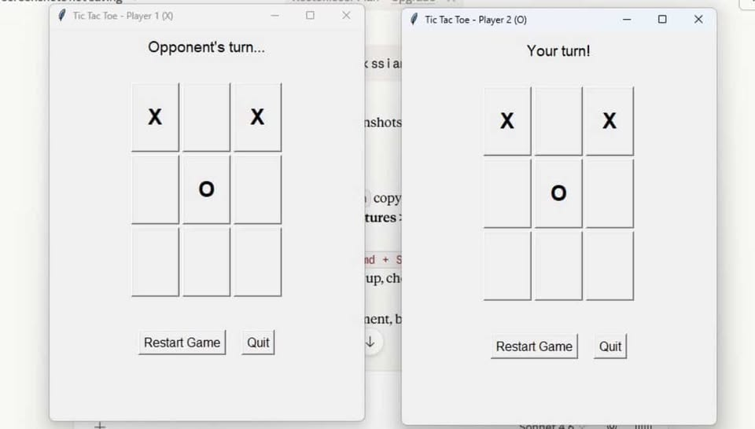
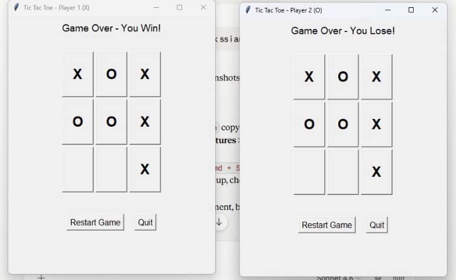

## Multiplayer Tic Tac Toe 🎮

A real-time multiplayer Tic Tac Toe game built with Python using socket programming and multithreading.

## Features
- Real-time multiplayer over a network
- Two players can connect from different machines
- Interactive GUI built with Tkinter
- Supports game restart without reconnecting

## Built With
- Python
- Sockets & Networking
- Threading
- Tkinter (GUI)

## How to Run
1. Run the server first
2. Run the client on two machines (or two terminals)
3. Enter the server IP when prompted

## Screenshots

